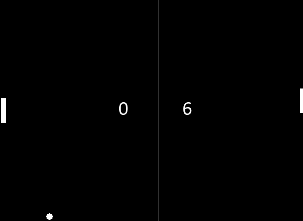

# Music Are Trying to Learn Game AI
## Step by Step installation for MAC OSX
To start with:
```
git clone https://github.com/pkumusic/AI.git
```
### 1.Deploy through virtual machine
1. I find it maybe better to deploy the environment in the virtual machine, because it would not cause version confliction between different python applications.
2. Install virtualenv
```
sudo easy_install pip
sudo pip install --upgrade virtualenv
```
3. use virtualenv and activate it
```
virtualenv ve2
alias ve2='source ~/ve2/bin/activate'
ve2
```
### 2. Try to run pong.py in games folder
1. If you start from a new ve as I do, you need to install numpy:
```
pip install numpy
```
2. Install pygame.
Try [this](http://pygame.org/wiki/macintosh)
```
export PATH=/usr/local/bin:$PATH
xcode-select --install
```
3. Install [XQuartz](http://xquartz.macosforge.org/landing/)
4. Install dependent libraries
```
brew link sdl
brew link --overwrite libpng
brew install hg sdl sdl_image sdl_mixer sdl_ttf portmidi
pip install hg+http://bitbucket.org/pygame/pygame
```
5. Now you should be able to run pong.py in AI/games
```
python pong.py
```
When it works, it would show the visualization of the game like following: 

### 3. Try to run deep_q_pong_player.py in examples folder
1. Install tensorflow
For Mac OS X, CPU only, Python 2.7:
```
$ export TF_BINARY_URL=https://storage.googleapis.com/tensorflow/mac/tensorflow-0.9.0-py2-none-any.whl
sudo pip install --upgrade $TF_BINARY_URL
```
Test it with:
```
python -c 'import tensorflow'
```
I met conflict with numpy version here.. I do a `pip uninstall numpy` and re-upgrade tensorflow here. It will automatically install the correct numpy version for me.

2. Install openCV (cv2 package in python)
```
pip install conda
conda install opencv
```


## Try [Deep-Q learning](https://www.cs.toronto.edu/~vmnih/docs/dqn.pdf)

[Ref](http://www.danielslater.net/2016/03/deep-q-learning-pong-with-tensorflow.html) of Daniel Slater's blog.

Install [Tensorflow](https://www.tensorflow.org/versions/r0.7/get_started/os_setup.html#pip-installation): ``


## My plan
1. For 'pong.py', write an simple rule-based AI that can beat default pong AI.

2. Try to deploy deep reinforcement learning on playing AI

3. Try other methods.

4. Thinking about possibilities for improvement.

5. Can we have a general solution for all games? All some kind of general solution for some kinds of games.


## Instruction from [Daniel Slater](https://github.com/DanielSlater/PyGamePlayer)
Module to help with running learning agents against PyGame games. Hooks into the PyGame screen update and event.get methods so you can run PyGame games with zero touches to the underlying game file. Can even deal with games with no main() method.

Project contains three examples of running this, 2 a minimal examles one with Pong and one with Tetris and a full example of Deep-Q learning against Pong with tensorflow.

More information available here http://www.danielslater.net/2015/12/how-to-run-learning-agents-against.html

Requirements
----------
- python 2 or 3
- pygame
- numpy

Getting started
-----------
PyGame is probably the best supported library for games in Python it can be downloaded and installed from http://www.pygame.org/download.shtml

[Numpy](http://www.scipy.org/scipylib/download.html) is also required

Create a Python 2 or 3 environment with both of these in it.

Import this project and whatever PyGame game you want to train against into your working area. A bunch of PyGame games can be found here http://www.pygame.org/projects/6 or alternatly just use Pong or Tetris that are included with this project.

[exmples/deep_q_pong_player.py](https://github.com/DanielSlater/PyGamePlayer/blob/master/examples/deep_q_pong_player.py) also requires that [tensorflow](https://www.tensorflow.org/versions/r0.8/get_started/os_setup.html) and [matplotlib](http://matplotlib.org/users/installing.html) be installed

Example usage for Pong game
-----------
```
from pygame_player import PyGamePlayer


class PongPlayer(PyGamePlayer):
    def __init__(self):
        super(PongPlayer, self).__init__(force_game_fps=10) 
        # force_game_fps fixes the game clock so that no matter how many real seconds it takes to run a fame 
        # the game behaves as if each frame took the same amount of time
        # use run_real_time so the game will actually play at the force_game_fps frame rate
        
        self.last_bar1_score = 0.0
        self.last_bar2_score = 0.0

    def get_keys_pressed(self, screen_array, feedback):
        # TODO: put an actual learning agent here
        from pygame.constants import K_DOWN
        return [K_DOWN] # just returns the down key

    def get_feedback(self):
        # import must be done here because otherwise importing would cause the game to start playing
        from games.pong import bar1_score, bar2_score

        # get the difference in score between this and the last run
        score_change = (bar1_score - self.last_bar1_score) - (bar2_score - self.last_bar2_score)
        self.last_bar1_score = bar1_score
        self.last_bar2_score = bar2_score

        return score_change


if __name__ == '__main__':
    player = PongPlayer()
    player.start()
```

Games
--------
- [Pong](https://github.com/DanielSlater/PyGamePlayer/blob/master/games/pong.py)
- [Tetris](https://github.com/DanielSlater/PyGamePlayer/blob/master/games/tetris.py)
- [Mini Pong](https://github.com/DanielSlater/PyGamePlayer/blob/master/games/mini_pong.py) - modified version of pong to run in lower resolutions
- [Half Pong](https://github.com/DanielSlater/PyGamePlayer/blob/master/games/half_pong.py) - simplified version of pong with just one bar 